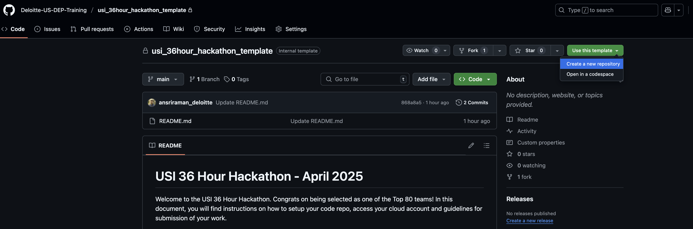
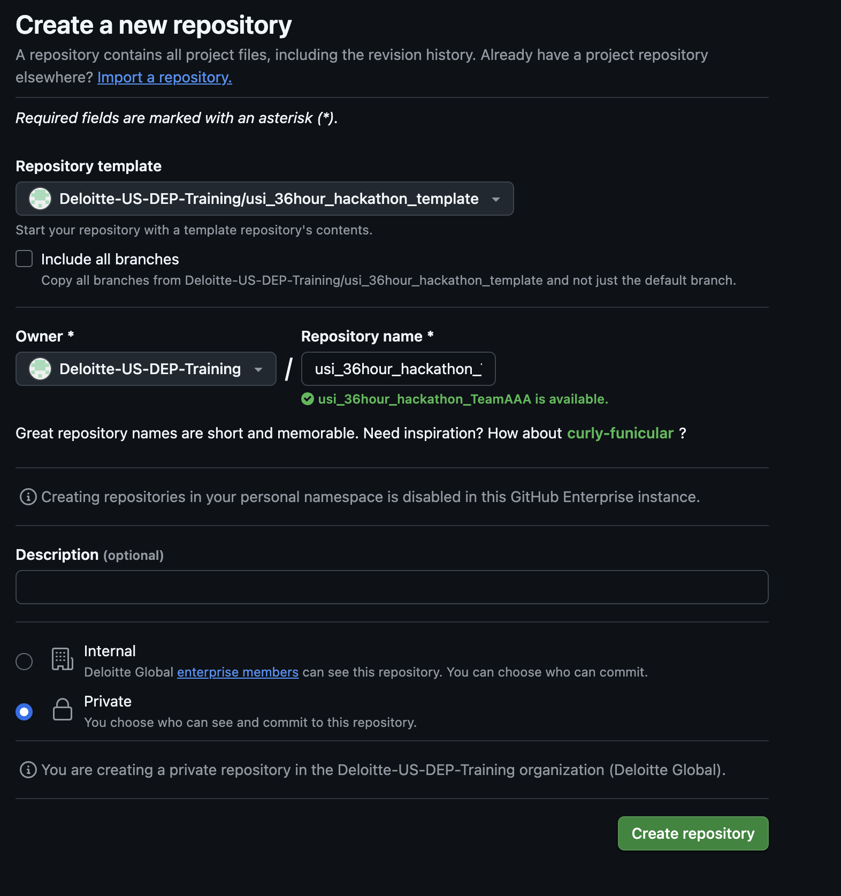
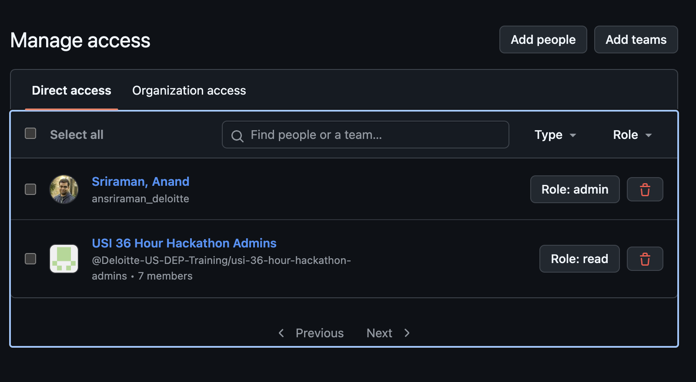

# USI 36 Hour Hackathon - April 2025

- [USI 36 Hour Hackathon - April 2025](#usi-36-hour-hackathon---april-2025)
  - [Getting Started](#getting-started)
    - [Step 1: Create your Repo using the template](#step-1-create-your-repo-using-the-template)
    - [Step 2: Add Collaborators](#step-2-add-collaborators)
  - [Cloud Account Access](#cloud-account-access)
  - [Submission Instructions](#submission-instructions)

Welcome to the USI 36 Hour Hackathon. Congrats on being selected as one of the Top 80 teams! In this document, you will find instructions on how to setup your code repo, access your cloud account and guidelines for submission of your work.

## Getting Started
To start, you need to create your team's code repository where you will store all the code for your project. 

[Create your team's repository here](https://github.com/new?owner=Deloitte-US-DEP-Training&template_name=usi_36hour_hackathon_template&template_owner=Deloitte-US-DEP-Training&name=usi_36hour_hackathon_)

### Step 1: Create your Repo using the template

You can start by using this template repository to create a new repo with the following name:

``
usi_36hour_hackathon_<team name>
``

where <team name> is the name of your team with spaces removed. For example, if your team name is "Wizards of Oz", then your repo name should be

``
usi_36hour_hackathon_WizardsOfOz
``

> **_NOTE:_**  Please ensure you follow this naming scheme for a valid submission. Also make sure that your repo is created with ``Private`` visibility.

### Step 2: Add Collaborators
Once your repo is created, you can go to the Settings tab of the repo and give access to your teammates by adding them under the "Collaborators and Teams" section. Please also give Read access to the "USI 36 Hour Hackathon Admins" team so that the hackathon organizers can view your repo. 

Now that your code repo is setup, you're ready to start coding!

## Cloud Account Access

To access the AWS account assigned to your team for this hackathon, you can follow the instructions provided by your CHS contacts. You will be using Okta to login to your AWS console, and you can use the Okta CLI to authenticate locally to your account.

## Submission Instructions

When you submit your solution at the end of the hackathon, you will be asked to fill in this form:

<https://americas.internal.deloitteonline.com/sites/usihackathon/Lists/usiHackathonPhase2Submissions/NewForm.aspx>

In this form, you should provide the URL to your Github repo for your team's code. Please ensure that all your code is commited to the repo before submission, ideally to the `main` branch.

Good luck with your submission!